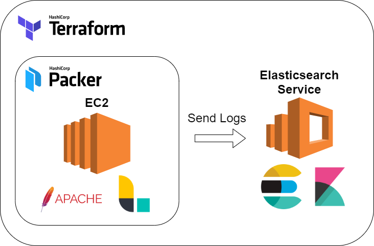

# Challenge Live Infrastructure

This repository contains configuration files defining the infrastructure as a code of the challenge for DevOps Engineer job position at [Pagar.me](http://pagar.me/).

# Challenge description

Create a monitoring infrastructure. The objective is to deploy an Elastic Stack (ELK) and be able to aggregate log data from an EC2 instance. 

What will be evaluated:

- Usage of an IaC tool (we use Terraform & Packer)
- Cloud knowledge (we use AWS)
- Mastery of good practices of infrastructure and systems resilience
- Practices of monitoring/observability
- Code organization

# Architecture




# Getting started

## Prerequisites

Install and setup the version manager [asdf](https://asdf-vm.com/#/) by running the following commands:

```sh
git clone https://github.com/asdf-vm/asdf.git ~/.asdf --branch v0.8.0

echo ". $HOME/.asdf/asdf.sh" >> ~/.bashrc  
```

Now install [Terraform](https://www.terraform.io/) and [Packer](https://www.packer.io/) by running:

```sh
asdf plugin add terraform
asdf install terraform 0.13.5
asdf global terraform 0.13.5

asdf plugin add packer
asdf install packer 1.6.5
asdf global packer 1.6.5
```

## Creating & Destroying

Initialize Terraform modules in the desired directory (e.g. `isac.aws/us-east-1/dev`) by running:

```
terraform init
```

To apply all the infrastructure, run the following command:

```sh
terraform apply -auto-approve
```

To destroy all the infrastructure, run the following command:

```sh
terraform destroy -auto-approve
```


## Elasticsearch tunnel


Add the following content to your `~/.ssh/config` file changing the variables accordingly

```conf
# Elasticsearch Tunnel
Host estunnel
  HostName <IP address>
  User ec2-user
  IdentitiesOnly yes
  IdentityFile <my key>
  LocalForward 9200 <Elasticsearch endpoint>
```

Then run the following command to create an SSH tunnel which allows you to reach Elasticsearch endpoint at `localhost:9200`

```sh
ssh estunnel -N
```